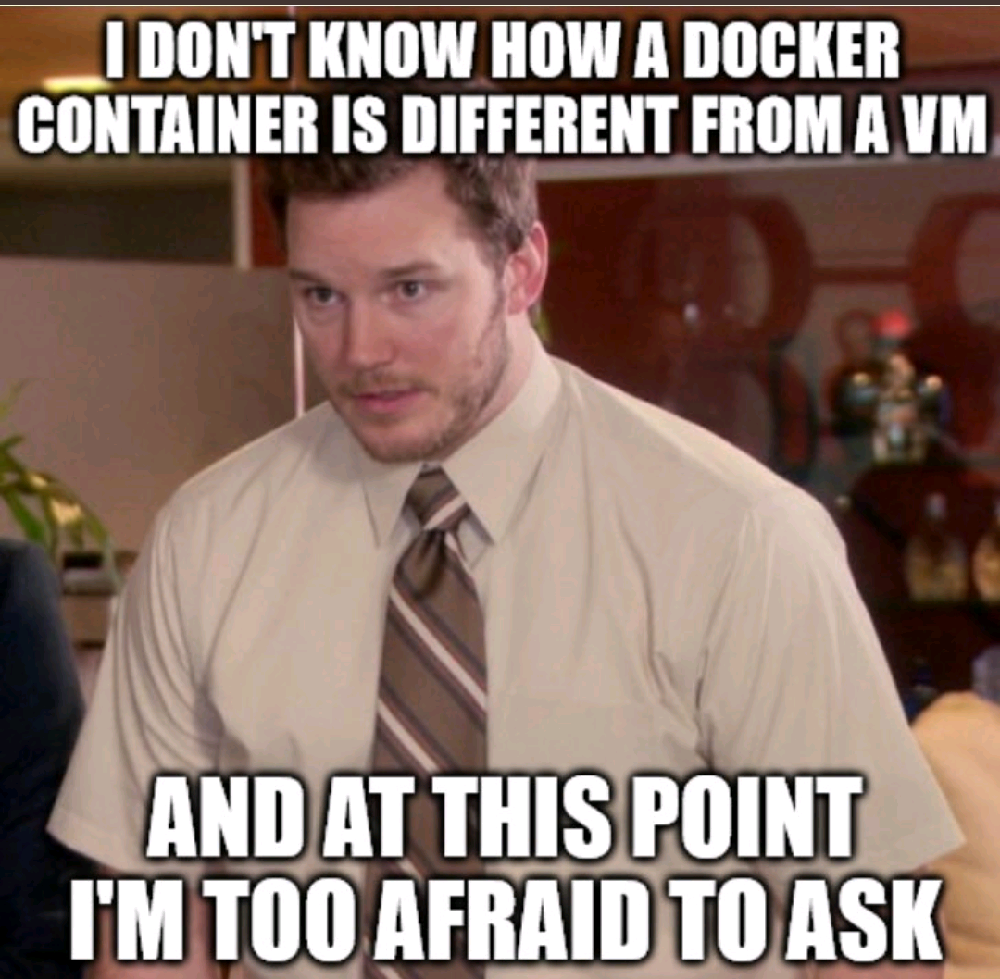

Hi 👋, in this post, we’ll explore common Docker misconfigurations that attackers exploit to compromise systems, such as exposed APIs and privileged containers. I’ll walk you through examples of these misconfigurations and show you how to detect them, providing valuable insights for threat hunters looking to secure Docker environments. Let’s get started!



---

## Exposed Docker APIs 💻

One of the most dangerous misconfigurations in Docker is exposing the Docker API to the internet without proper authentication. The Docker API allows full control over the container environment, and when it's publicly exposed, attackers can remotely access and manage containers.

### Attack Overview
Docker’s API typically listens on a local Unix socket, but some configurations expose the API over TCP, usually on port **2375** or **2376**. If attackers find an exposed API, they can control containers remotely without any authentication.

### Exploitation
Attackers often use tools like **Shodan** to scan for exposed Docker APIs. Once they find one, they can use commands like this to create containers remotely:

```bash
curl -X POST http://<docker_host_ip>:2375/containers/create -d '{"Image":"alpine"}'
```

This command creates a new container without any permissions required.

### Detection Strategy
To detect exposed Docker APIs:
1. Use **Nmap** to scan for open Docker API ports:

```bash
nmap -p 2375 --open <target_subnet>
```

2. Monitor API logs for unusual activity, especially API requests originating from external IPs.

---

## Privileged Containers 🚀

Running Docker containers in **privileged mode** gives them full access to the host’s devices and resources, significantly increasing the attack surface. This misconfiguration can lead to container escapes, where attackers can interact with the host system directly.

### Attack Overview
A privileged container has root-level access to the host’s devices, which allows attackers to escape the container’s isolation and interact with the host.

### Exploitation
Once inside a privileged container, attackers can mount the host's root directory and manipulate the file system. Here’s how:

```bash
docker run --privileged -v /:/host --rm -it alpine chroot /host
```

This grants access to the entire host’s file system, enabling the attacker to read or modify critical files.

### Detection Strategy
To hunt for privileged containers, run the following command:

```bash
docker inspect --format '{{ .HostConfig.Privileged }}' $(docker ps -q)
```

Investigate any containers running in privileged mode and verify whether it is necessary.

---

## Insecure Volume Mounts 📁

Docker containers can mount directories from the host file system, which is useful for sharing data. However, insecure mounts of sensitive directories (such as `/etc` or `/root`) can give attackers access to important host files.

### Attack Overview
By mounting sensitive directories into a container, attackers can easily read and modify host data, bypassing the isolation that containers usually provide.

### Exploitation
An attacker can mount the entire host file system and access critical files:

```bash
docker run -v /:/host --rm -it alpine /bin/sh
```

Once inside, they can access critical data:

```bash
cat /host/etc/shadow
```

### Detection Strategy
Inspect Docker containers for dangerous volume mounts:

```bash
docker inspect --format '{{ .Mounts }}' $(docker ps -q)
```

Pay special attention to mounts involving directories like `/`, `/etc`, or `/root`.

---

## Cgroups and Namespace Escapes 🛡️

Docker uses **cgroups** and **namespaces** to isolate containers from the host and from each other. However, containers with excessive privileges, such as the `SYS_ADMIN` capability, can escape this isolation and interact directly with the host.

### Attack Overview
When attackers gain control of a container with excessive capabilities, they can break out of the container’s isolation, giving them access to the host system.

### Exploitation
By running a container with the `SYS_ADMIN` capability, an attacker can perform operations that allow them to escape to the host:

``` bash
docker run --cap-add=SYS_ADMIN -it alpine /bin/sh
```

### Detection Strategy
To detect containers running with dangerous capabilities, inspect all running containers:

```bash
docker inspect --format '{{ .HostConfig.CapAdd }}' $(docker ps -q)
```

Look for capabilities like `SYS_ADMIN` or `NET_ADMIN`, which grant elevated privileges.

---

## Resource Exhaustion: Denial of Service (DoS) 💥

Containers that lack resource limits can consume large amounts of CPU, memory, or disk space, which can lead to a Denial of Service (DoS) attack. Attackers can exploit this by running containers that intentionally exhaust system resources, leading to a crash.

### Attack Overview
By default, Docker doesn’t impose strict resource limits on containers. Attackers can take advantage of this by creating containers that consume all available system resources, causing system slowdowns or crashes.

### Exploitation
An attacker can run a container that consumes excessive resources, such as CPU, using the `stress` tool:

```bash
docker run --rm -it --cpu-shares=1024 --memory=1g stress --cpu 8 --timeout 60
```


This command forces the container to use 8 CPU cores, potentially overwhelming the host.

### Detection Strategy
Monitor Docker containers for excessive resource usage using the `docker stats` command:

``` bash
docker stats
```

Look for containers consuming abnormally high CPU or memory and enforce resource limits to prevent abuse.

---

### Conclusion

- **Hunt for Exposed APIs**: Scan for open Docker API ports and review access logs for unauthorized requests.
- **Privileged Container Detection**: Identify and investigate containers running with privileged mode.
- **Insecure Mounts**: Hunt for containers mounting sensitive directories from the host.
- **Excessive Capabilities**: Detect containers with dangerous capabilities like `SYS_ADMIN` and reduce permissions.
- **Resource Abuse**: Monitor resource usage to detect abnormal spikes that could indicate a denial of service attempt.

These misconfigurations are prime targets for attackers, making them crucial areas for threat hunters to focus on.

**References**:

- [Docker Security Best Practices](https://docs.docker.com/engine/security/security/)
- [Docker Security Cheat Sheet](https://cheatsheetseries.owasp.org/cheatsheets/Docker_Security_Cheat_Sheet.html)

